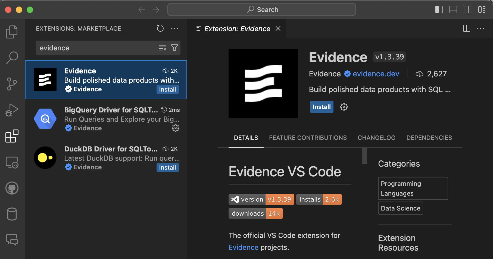
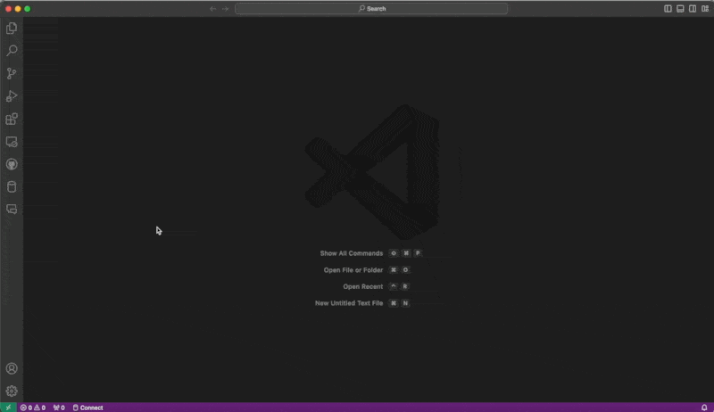
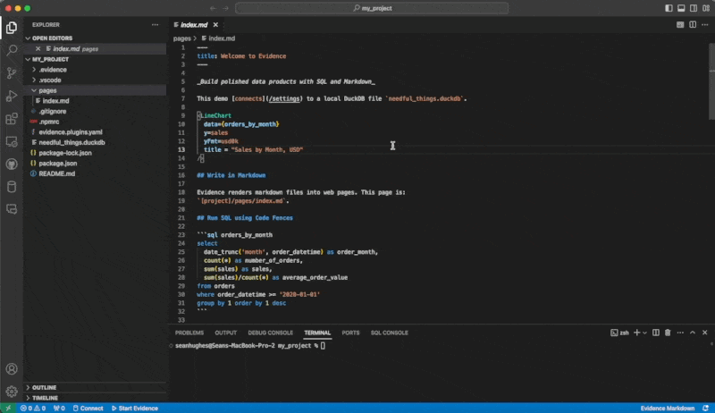
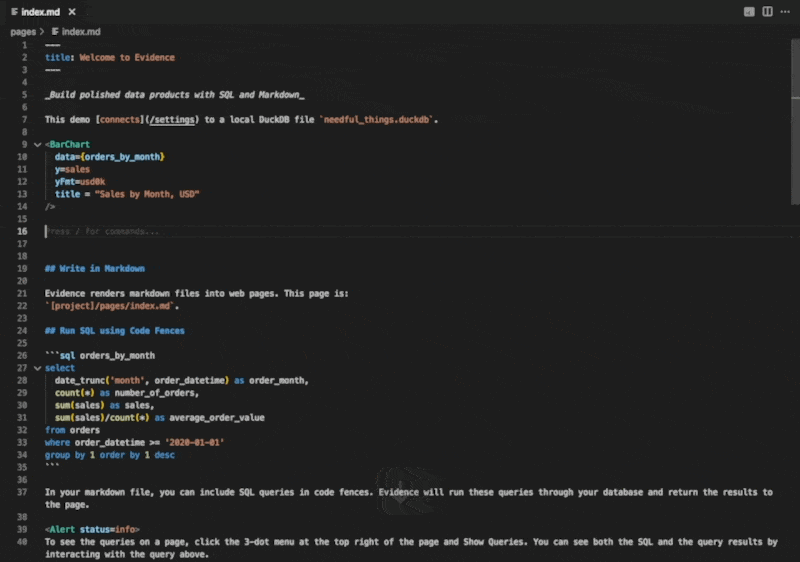
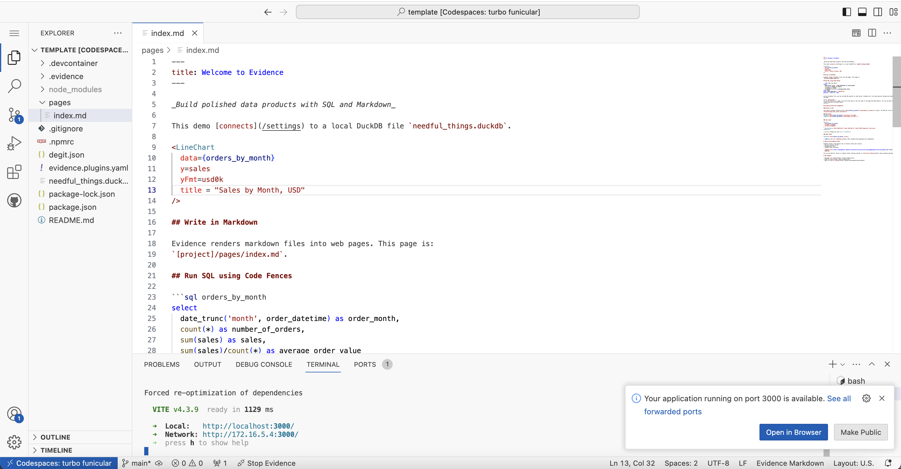
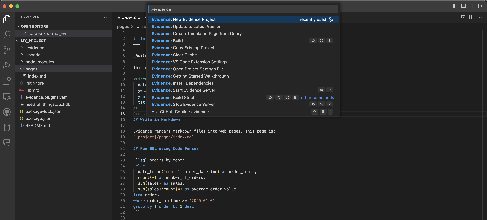
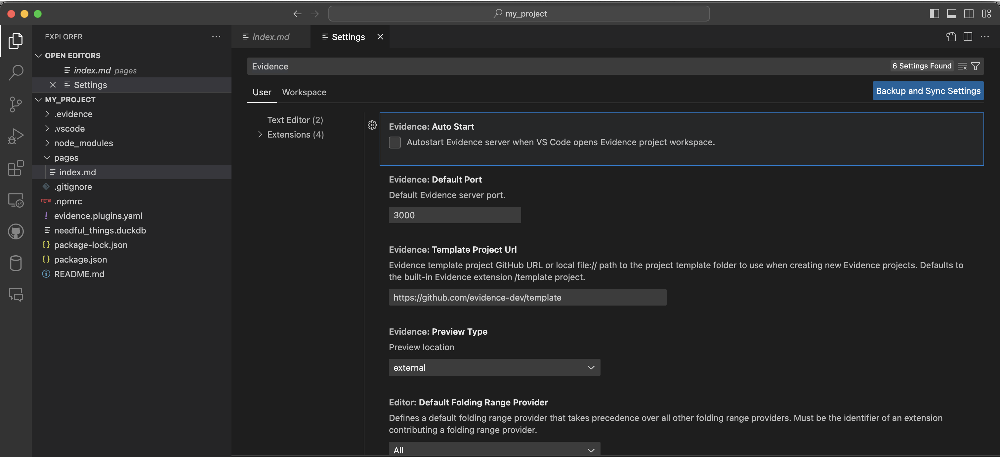

# Evidence VS Code

[](https://marketplace.visualstudio.com/items?itemName=Evidence.evidence-vscode)
[](https://marketplace.visualstudio.com/items?itemName=Evidence.evidence-vscode)
[](https://marketplace.visualstudio.com/items?itemName=Evidence.evidence-vscode)

[Evidence](https://evidence.dev) is an open source toolkit for building data products with just SQL and markdown. Connect to your database, write SQL queries, and include charts, tables, and dynamic text - all from markdown. To get started, visit the [docs.](https://docs.evidence.dev)

This extension provides language support, Evidence and dev server shortcut commands, and autocomplete for Evidence Markdown files.


## Features

- Syntax highlighting for:
  - Markdown
  - SQL Query Blocks
  - Components (Svelte syntax highlighting)
  - JavaScript expressions
- Autocomplete suggestions for inserting:
  - Components (Charts, Tables, Text Components)
  - SQL Query Blocks
  - Templating (Loops, Conditionals)
- Evidence commands to:
  - Create new app
  - Start and stop dev server
  - Update to the latest version
  - View extension settings
  - Clear app data and queries cache
  - Build app for deployment to production
  - Preview Evidence markdown documents

## Requirements

Evidence requires **NodeJS** between `version 16.14` and `version 20.9`. You can download and install the latest long-term support (LTS) version from [nodejs.org](https://nodejs.org/en/download/).

This extension also depends on [Svelte for VS Code](https://marketplace.visualstudio.com/items?itemName=svelte.svelte-vscode) that provides syntax highlighting and rich intellisense for Svelte components in VS Code. Svelte for VS Code will be installed automatically when you install Evidence extension.

## Installation

You can install the Evidence extension from the [VS Code Marketplace](https://marketplace.visualstudio.com/items?itemName=Evidence.evidence-vscode), or by searching for `Evidence` in the VS Code Extensions tab.



## Getting Started

To get started with Evidence using VS Code locally, follow these steps:

1. Open the command palette in VS Code (Cmd/Ctrl + Shift + P)
2. Search for and click `New Evidence App`
3. Select an **empty** folder to create your Evidence app within<br><br>
   

4. Click the `Start Evidence` button to install all required dependencies and start the dev server, or use the commands detailed below in the `Commands` section<br><br>
   
   <br><br> **Note:** The initial installation and server start can take up to 2 minutes depending on your computer. If you have issues with the startup time, you can use Codespaces (see next section).<br><br>
   At the end of this step, your browser will automatically open to your app preview, which will appear at `localhost:3000`

5. We recommend putting VS Code and your browser side-by-side, like in the screenshot below. This will give you immediate development feedback on your app every time you save a markdown file.<br><br>
   

6. Make changes to your markdown files and save the file to see the changes reflected in your app preview

7. Try the "slash commands" included with the extension by typing `/` - you will see a list of available viz and UI components from our library. Select a component to insert by hitting `Tab` or clicking on the component.<br><br>
   Once the component code has been inserted, you can hit `Tab` again to move through the inputs for a component and fill them in.<br><br>
   

## Running Evidence in GitHub Codespaces

You can use the Evidence VS Code extension with [GitHub Codespaces](https://github.com/features/codespaces).

1. [Click here to create a new app in Codespaces](https://github.com/codespaces/new?machine=standardLinux32gb&repo=399252557&ref=main&geo=UsEast)
2. The Evidence extension will be installed automatically
3. Click the `Start Evidence` button to install all required dependencies and start the dev server, or use the commands detailed below in the `Commands` section
4. You will get a popup saying `Your application running on port 3000 is available`. Click to open in browser<br><br>
   

5. Make changes to your markdown files and **save the file** to see the changes reflected in your app preview

6. After making changes to your app, click the `Source Control` icon in the left panel and commit your changes<br><br>
   

7. Click `Publish Branch` - this will prompt you to create a private or public repo for your Evidence app<br><br>
   

8. From here, you can continue to develop your app in Codespaces, or you can choose to clone your repo locally and work from there

## Commands

The Evidence extension provides a number of custom VS Code shortcut commands for Evidence. Most of these correspond to CLI commands which can be run from your terminal if you prefer.

You can access the VS Code shortcut commands from the command palette (`Cmd/Ctrl+Shift+P`) by typing `Evidence` in the command search box:



| VS Code Command       | Title                      | Description                                                                                     | CLI Command                                                                      |
| --------------------- | -------------------------- | ----------------------------------------------------------------------------------------------- | -------------------------------------------------------------------------------- |
| `newProject`          | New Evidence App           | Create new Evidence app in the open workspace, or the selected folder in VS Code File Explorer. | `npx degit evidence-dev/template my-project`<br>`cd my_project`                  |
| `installDependencies` | Install Dependencies       | Install Evidence app NodeJS modules.                                                            | `npm install`                                                                    |
| `runSources`          | Run Sources                | Run all source queries                                                                          | `npm run sources`                                                                |
| `startServer`         | Start Dev Server           | Start Evidence app dev server.                                                                  | `npm run dev`                                                                    |
| `stopServer`          | Stop Dev Server            | Stop Evidence app dev server.                                                                   | `Ctrl + C`                                                                       |
| `build`               | Build                      | Build Evidence app for deployment to production.                                                | `npm run build`                                                                  |
| `buildStrict`         | Build Strict               | Build Evidence app for deployment to production in a strict mode.                               | `npm run build:strict`                                                           |
| `updateDependencies`  | Update to Latest Version   | Update all Evidence app NodeJS libraries to the latest version.                                 | `npm install @evidence-dev/evidence@latest @evidence-dev/core-components@latest` |
| `clearCache`          | Clear Cache                | Clear Evidence application data and queries cache.                                              |
| `viewSettings`        | VS Code Extension Settings | View Evidence extension settings in the built-in VS Code Settings editor.                       |
| `copyProject`         | Copy Existing App          | Provide a URL of a Github repo to pull from                                                     |

## Deployment

You can self-host or deploy on Evidence Cloud, with a public app or behind user authentication.

Evidence apps utlize a scheduled build process, which runs the queries, and builds all of your pages. The output of this process is a pre-built, self-contained static web application.

This results in near instant page loads for your users and means that they are not hitting your data warehouse by interacting with their reports.

Despite this static output, you can still deliver fully interactive and exporable data products through our most recent release for [Universal SQL](https://evidence.dev/universal-sql)

[Sign up for Evidence Cloud here](https://evidence.dev/cloud)

[Learn more about deployment here](https://docs.evidence.dev/deployment/overview)

## Settings

Create [User or Workspace Settings](https://code.visualstudio.com/docs/getstarted/settings#_creating-user-and-workspace-settings) to change default Evidence VS Code extension Settings.

Open Evidence extension Settings in VS Code by using the `Evidence: VS Code Extension Settings` command, or navigating to `File -> Preferences -> Settings` (`cmd/ctrl+,`) and searching for `Evidence` in the Settings search box.



### Available Settings

Note that after editing some settings you may need to close and reopen VS Code for the new setting to take effect.

| Setting                       | Name             | Type       | Default Value                                           | Description                                                                                                                                                                                                                              |
| ----------------------------- | ---------------- | ---------- | ------------------------------------------------------- | ---------------------------------------------------------------------------------------------------------------------------------------------------------------------------------------------------------------------------------------- |
| `evidence.previewType`        | Preview Type     | string     | `external`                                              | Where to show development app preview: web browser, in VS Code (side-by-side), in VS Code (full width)                                                                                                                                   |
| `evidence.defaultPort`        | Default Port     | number     | `3000`                                                  | Default Evidence app dev server port.                                                                                                                                                                                                    |
| `evidence.autoStart`          | Auto Start       | boolean    | `false`                                                 | Automatically start Evidence app dev server when opening an app in VSCode.                                                                                                                                                               |
| `evidence.slashCommands`      | Slash Commands   | boolean    | `true`                                                  | Enabled slash commands - get component suggestions when typing `/`                                                                                                                                                                       |
| `evidence.templateProjectUrl` | Template App Url | Url string | [`/template`](https://github.com/evidence-dev/template) | Evidence `template` app GitHub Url or local `file://` path to the app template folder to use when creating new Evidence app. Defaults to the Evidence template Github repository [`/template`](https://github.com/evidence-dev/template) |

You can request new Evidence extension settings to enhance this extension user experience in VS Code by submitting a [feature request in Discussions](https://github.com/evidence-dev/evidence/discussions/new?category=ideas) or [pull request](https://github.com/evidence-dev/evidence/pulls).

### VS Code Settings JSON

You can also reconfigure Evidence extension settings in `vscode/settings.json` workspace configuration file. The `.vscode/settings.json` file is a `JSON` file that stores your VS Code Settings. It contains settings that apply globally to all workspaces open in VS Code, or to a specific workspace.

Edit your settings in `./vscode/settings.json` by opening the `Command Palette...` with `cmd/ctrl+shift+p`, searching for and selecting `Preferences: Open Workspace Settings (JSON)` command.


### Evidence Settings

All Evidence extension settings start with `evidence.` prefix. You can overwrite default Evidence extension settings in the open workspace directly by opening and changing `/.vscode/settings.json` in your app directory.

The following Evidence workspace `/.vscode/settings.json` example sets different default Evidence dev server port, overwrites new dev server `autoStart` setting, and uses a modified local copy of the built-in Evidence [`/template`](https://github.com/evidence-dev/template) app with `file://` Uri to create new Evidence apps.

```
{
  "evidence.defaultPort": 5000,
  "evidence.autoStart": "false",
  "evidence.templateProjectUrl: "file://E:/projects/evidence.dev/template"
}
```

## Contribute to this extension

If you would like to contribute to this VS Code extension, we welcome PRs and issues in the [Github repo](https://github.com/evidence-dev/evidence).

## Support

If you run into any issues setting up the extension, please reach out:

- [Open an issue on GitHub](https://github.com/evidence-dev/evidence/issues)
- Post in our [Slack community](https://slack.evidence.dev)
- Email <support@evidence.dev>
